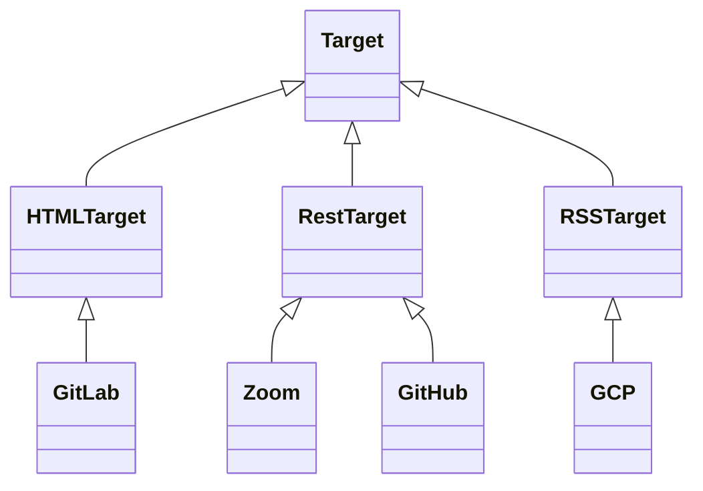

https://www.githubstatus.com/api
https://learn.microsoft.com/en-us/rest/api/azure/devops/status/health/get?view=azure-devops-rest-7.0&tabs=HTTP#get-service-health-for-one-or-more-geographies

# API Unified Availability Status Server

In this exercise, you are going to design and implement a unified API for availability of public services.
The server exposes a unified well-defined API for accessing the availability status of public services, such as GitHub, Azure, etc....

## Background 

The availability API of public services is a set of web-based interfaces that provide information about the health and availability of public services, such as cloud platforms (AWS, Azure, GCP), social media sites (Facebook, Twitter), etc...
These API's allow DevOps engineers to monitor the status of various services and ensure that they are working as expected.
By checking the availability API, DevOps teams can be alerted to any issues affecting the service and take corrective action to prevent or minimize downtime.

Having access to the availability API can be crucial for businesses and organizations that rely on public services to operate, as any service disruption can result in significant loss of revenue, productivity, and customer satisfaction.

The availability API typically provides information about the current status of the service, including any outages, performance issues, or planned maintenance.
It may also provide additional details such as the root cause of the problem, the estimated time to resolution, and any workarounds or mitigation steps that can be taken.

here are some examples of public services and their respective API's to check their health and availability:

- GitHub Status API - https://www.githubstatus.com/api/v2/status.json
- Google Cloud Status Dashboard API - https://status.cloud.google.com/incidents.json
- AWS Service Health Dashboard API - https://status.aws.amazon.com/data.json
- Azure Service Health API - https://docs.microsoft.com/en-us/rest/api/servicehealth/
- Azure DevOps - https://status.dev.azure.com/_apis/status/health
- Twitter API - https://developer.twitter.com/en/docs/twitter-api/enterprise/getting-started/enterprise-account-activity-api/guides/enterprise-account-activity-api-overview
- Slack API - https://api.slack.com/methods/team.info
- Zoom API - https://status.zoom.us/api/v2/components.json
- Microsoft Office 365 Service Communications API - https://docs.microsoft.com/en-us/office/office-365-management-api/office-365-service-communications-api-reference
- Google Workspace Status API - https://developers.google.com/admin-sdk/reports/reference/rest/v1/activities
- Facebook API - https://developers.facebook.com/docs/graph-api/reference/v11.0/insights#availmetrics
  https://status.gitlab.com/

Note that some of these API's may require authentication and/or authorization before they can be used.


## Motivation 

The motivation behind creating a unified API for public services availability is to simplify the process of monitoring and managing multiple services from a single interface.
Without a unified API, DevOps teams would need to monitor each service separately, which can be time-consuming and difficult to manage.
A unified API provides a standard and consistent way to access the availability information of different public services, making it easier to aggregate and analyze data across different platforms.

In addition, a unified API can help to reduce the risk of errors and inconsistencies that can occur when using multiple APIs with varying formats and protocols. 
By standardizing the API format, DevOps teams can reduce the complexity of their monitoring and management systems, making it easier to maintain and troubleshoot.

Here is the higher level diagram of the system design:


## Code design



## Implementation guideline 

### Get all endpoint 

```http
GET /api/status
```

#### Response

```json
{
  "targets": [
    {
      "name": "github",
      "endpoint": "https://www.githubstatus.com/api/v2/status.json",
      "type": "REST",
      "services": [
        {
          "name": "pages",
          "lastTimestamp": "",
          "status": "OK",
          "dimensions": {
            "region": "us-east-1"
          }
        }
      ]
    }
  ]
}
```

#### Response Parameters

- targets (array): An array of objects that represent the targets being monitored.
  - name (string): The name of the target.
  - endpoint (string): The URL endpoint for the target.
  - type (string): The type of the target (allowed values are "RSS", "HTML", "REST", or any other type you'll create).
  - services (array): An array of objects that represent the services provided by the target.
    - name (string): The name of the service.
    - lastTimestamp (string): The timestamp of the last status update for the service.
    - status (string): The current status of the service (allowed values are "OK", "Degraded", "Outage", "Unknown").
    - dimensions (object): An object containing additional information about the service (e.g. region, version).

#### Example

Request

```http
GET /api/status HTTP/1.1
Host: localhost:8080
```

Response

```json
{
  "targets": [
    {
      "name": "github",
      "endpoint": "https://www.githubstatus.com/api/v2/status.json",
      "type": "REST",
      "services": [
        {
          "name": "Git Operations",
          "lastTimestamp": "2023-04-18T09:45:04.745Z",
          "status": "OK",
          "dimensions": {
            "serviceId": "4230lsnqdsld"
          }
        },
        {
          "name": "Webhooks",
          "lastTimestamp": "2022-09-07T00:08:33.519Z",
          "status": "OK",
          "dimensions": {
            "region": "us-east-1"
          }
        },
        {
          "name": "Pull Requests",
          "lastTimestamp": "2023-04-18T09:45:04.745Z",
          "status": "OK",
          "dimensions": {
            "region": "us-east-1",
            "only_show_if_degraded": false
          }
        }
      ]
    },
    {
      "name": "aws",
      "endpoint": "https://health.aws.amazon.com/health/status",
      "type": "RSS",
      "services": [
        {
          "name": "EC2",
          "lastTimestamp": "2023-04-18T09:45:04.745Z",
          "status": "OK",
          "dimensions": {
            "region": "eu-north-1"
          }
        },
        {
          "name": "EC2",
          "lastTimestamp": "2023-04-15T09:00:04.452",
          "status": "OK",
          "dimensions": {
            "region": "eu-east-1"
          }
        }
      ]
    }
  ]
}
```

### Get by target and service

```http
GET /api/status/{target}/{service}
```

### Get by status

```http
GET /api/status?status=<down>
```

### (Optional) Display results in Grafana

1. Run Grafana server in a Docker container by
   ```shell
   docker run --rm --name grafana grafana/grafana-oss
   ```
2. After initialization, visit you server in [http://localhost:3000](http://localhost:3000).
3. Default username and password is `admin`.
4. Now we want to integrate InfluxDB as a data source in Grafana. On the left menu, under **Configuration** button, click **Data sources**.
5. In the opened configuration console, choose **Add data source**, then choose **InfluxDB**.
6. In the data source setting page, under **HTTP** section **URL** field, enter influxDB url: `http://localhost:8086`.
7. In **Auth** section, turn on the **Basic auth** toggle, and enter the InflucDB username (`admin`) and password (`12345678`) in the appropriate fields below.
8. In **InfluxDB Details** section, under **Database** enter your db name: `hosts_metrics`.
9. Finally, click **Save & Test**, and make sure you get the _Data source is working_ message.
10. Click **Explore**
11. In the exploration panel, build a graph of the test results over time. Your graph should look similar to the bellow screenshot.   
    


## (Optional) Extensions

Store the data in a database

create an endpoints for incidents 


## Submission 


